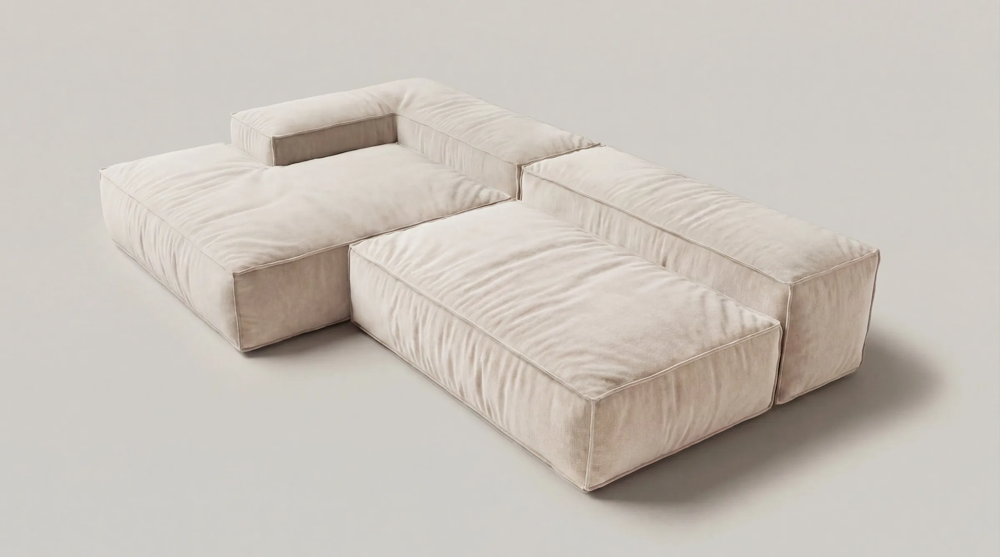
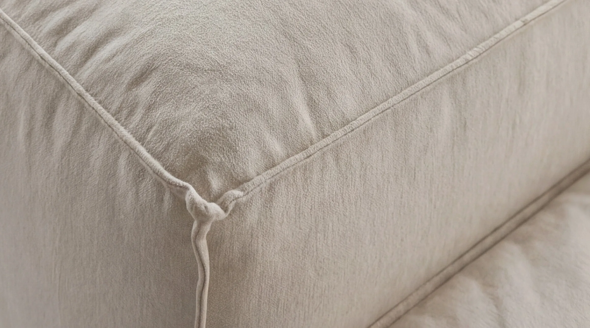

# Audyt strony raveforms

Data: 7 maja 2026
Zakres: index.html, about.html, products.html, accessories.html, contact.html, privacy.html, style.css, JS inline.

---

## TL;DR — co jest dobre, co boli

**Mocne strony.** Estetyka jest spójna i zdecydowana. Typografia (Space Mono + Inter), paleta (#F0EDE4 / #111) i layout w stylu siatki z hairline-borderami (#C8C4BB) tworzą wyrazisty język wizualny — to nie wygląda jak kolejny szablon. Hero ze scrubowaną animacją 140 klatek to mocne wejście, a microcopy ("we don't make sofas. we make surfaces.") trzyma jeden ton od homepage do about. Strona jest mobile-first, ma poprawny banner cookie zgodny z GDPR i działający formularz kontaktowy (Formspree).

**Co najmocniej boli.**
1. **Zero SEO ponad title.** Brak meta description, brak Open Graph, brak Twitter Card, brak Schema.org Product/Organization, brak canonical, brak robots.txt, brak sitemap.xml. Wysłanie linku w WhatsApp lub na IG da pusty preview — dla marki premium to drogi błąd.
2. **EN/TH toggle to atrapa.** Klik tylko zmienia kolor liter — żadne treści się nie tłumaczą, a `<html lang="en">` zostaje. Dla marki z Bangkoku, której rynek lokalny jest pierwszy, to nie jest detal.
3. **Brak cen i widełek czasowych.** Nigdzie nie ma "from THB X" ani lead time'u dostawy. Dla mebli premium robionych na zamówienie to największy hamulec konwersji — kupujący nie wie, czy patrzy na 80k czy 800k THB.
4. **Brak social proof.** Zero recenzji, zero zdjęć w mieszkaniach klientów, zero press mentions, zero "as seen in". Dla młodej marki design-led to zwykle największa nieskorzystana dźwignia.
5. **Trasa do zakupu jest jednowarstwowa.** Każdy CTA prowadzi do `contact.html` → ogólny formularz. Brak quote buildera, brak konfigurator → cennik, brak WhatsApp/Line click-to-chat (a to lokalnie dominujące kanały).

Reszta dokumentu rozwija to po sekcjach.

---

## 1. SEO i metadane

### Title tags
Wszystkie tytuły mają wzór `raveforms / nazwa-strony`:

```
<title>raveforms</title>
<title>raveforms / about</title>
<title>raveforms / sofas</title>
<title>raveforms / accessories</title>
<title>raveforms / contact</title>
<title>raveforms / privacy policy</title>
```

To jest minimalistyczne, ale w wynikach Google wygląda anonimowo. Nikt nie wpisuje "raveforms" — wpisują "modular sofa Bangkok", "oversized lounge sofa Thailand", "made-to-order sofa". Title to wciąż jeden z 3-4 najsilniejszych sygnałów rankingu.

Propozycje:
- `raveforms — modular sofas made to order in Bangkok` (homepage)
- `Cloud Form — oversized modular sofa | raveforms` (products)
- `Cloud Form Pillow — oversized cushion | raveforms` (accessories)
- `About — design philosophy and craft | raveforms`
- `Contact — order, quote or visit our Bangkok studio | raveforms`

### Meta description — w ogóle nie ma
Każda strona powinna mieć ~150 znaków. Dla homepage:

```html
<meta name="description" content="raveforms designs and builds oversized, made-to-order modular sofas in Bangkok. L-shape, linear and U-shape forms in cotton, corduroy or leather.">
```

### Open Graph i Twitter Card
Brak. Konsekwencja: każdy link wklejony do Slacka, WhatsAppa, IG DM-a, iMessage czy LinkedInu pokaże tylko URL. Konieczne minimum:

```html
<meta property="og:title" content="raveforms — modular sofas made to order in Bangkok">
<meta property="og:description" content="Oversized, mattress-scale forms. L-shape, linear, U-shape.">
<meta property="og:image" content="https://raveforms.com/og-cover.jpg">
<meta property="og:url" content="https://raveforms.com/">
<meta property="og:type" content="website">
<meta name="twitter:card" content="summary_large_image">
```

OG image: 1200×630, np. render Cloud Form na czystym tle z logo w rogu. Ten sam obraz wystarczy globalnie, można podmieniać per produkt.

### Schema.org / structured data
Brak. Najmocniejszy quick win to JSON-LD `Organization` na wszystkich stronach + `Product` na products i accessories. Na contact dodaj `LocalBusiness` z adresem, telefonem, godzinami otwarcia (jeśli jest studio do odwiedzenia) — to zasila Google Knowledge Panel i Google Maps.

### Canonical
Brak. Dla bezpieczeństwa duplikatów (np. raveforms.com vs www.raveforms.com vs Instagram-link-tracking) dodaj na każdej stronie:

```html
<link rel="canonical" href="https://raveforms.com/index.html">
```

### Robots.txt i sitemap.xml
Nie istnieją w folderze. Stwórz:

```
# robots.txt
User-agent: *
Allow: /
Sitemap: https://raveforms.com/sitemap.xml
```

Sitemap.xml z 6 URL-ami (index, about, products, accessories, contact, privacy) — bardzo prosta robota na 5 minut.

### Atrybut lang
Wszędzie `<html lang="en">`, ale toggle EN/TH sugeruje obsługę dwóch języków, a w praktyce nie zmienia ani lang, ani treści. Dwa rozwiązania:
- Albo zaimplementować realną wersję TH (osobny katalog `/th/`, dwa zestawy plików, hreflang) — sensowne, bo Bangkok.
- Albo usunąć toggle, dopóki nie ma tłumaczenia. Atrapa pogarsza zaufanie bardziej niż brak opcji.

### H1 na homepage
Index.html nie ma `<h1>`. Hero ma tylko captiony w `<p>`, a `<h2>` pojawia się dopiero w `.hero-statement` ("A sofa that doesn't tell you how to sit."). To technicznie nadal indeksowalne, ale promote `<h2>` do `<h1>` na homepage (lub zrób dodatkowe wizualnie ukryte H1 z keywordami).

### Alt teksty na obrazach
Wszystkie zdjęcia w products.html mają tę samą wartość `alt="L-shape sofa"`. To nie pomaga ani SEO, ani screen readerom. Zróżnicuj:

```html


```

W accessories.html jest lepiej (`alt="Pillow - cotton"` itd.), ale i tak warto rozszerzyć.

### Performance / Core Web Vitals
Hero preloaduje **wszystkie 140 klatek od razu** w pętli `for(j=0;j<TOTAL;j++)`. Każda klatka to ~50-200KB WebP, czyli homepage ściąga prawdopodobnie 7-20MB zanim cokolwiek się pokaże. Konsekwencje: złe LCP, słaby score na PageSpeed, drogie dla użytkowników mobilnych w Tajlandii.

Quick win: ładuj progresywnie — najpierw klatki 0/35/70/105/140, potem reszta wokół aktualnej pozycji scrolla. Albo zmniejsz liczbę klatek do 60-80 i zachowaj smooth z `requestAnimationFrame` interpolation.

---

## 2. Konwersja (CRO)

### Brak cen — najpoważniejszy problem komercyjny
Nie chodzi o to, by pokazać dokładny price tag (przy made-to-order to ryzykowne). Ale brak nawet "starts from THB 65,000" sprawia, że odwiedzający z budżetem 30k odpada nie z powodu ceny, tylko z powodu niepewności. Pokaż widełki:

> Cloud Form — starts from THB 89,000 / configurations from THB 89,000–185,000

To filtruje publiczność i podnosi jakość leadów w formularzu.

### Każde CTA prowadzi do tego samego miejsca
Na homepage: "View products", "Order now". Na products: "Order". Na accessories: "Order". Wszystko prowadzi do `contact.html` → ten sam formularz dla wszystkich. Tracone informacje: który wariant interesuje klienta, jakie wymiary, jaka tkanina.

Quick win: prefilluj formularz parametrami URL z products/accessories (`contact.html?product=cloud-form&config=l-shape&fabric=cotton`) i pokaż je jako ukryty input lub jako label nad polem "Message". Wtedy Formspree dostaje precyzyjny brief, a klient nie musi kopiować nazw konfiguracji.

### Brak express channels do zakupu
Bangkok ≠ Berlin. Dla Tajlandii dominują Line, WhatsApp i IG DM, nie email. CTA "Order now" idący do formularza z 48h response time przegrywa z konkurencją, która ma Line click-to-chat na każdej karcie produktu. Dodaj:

```html
<a href="https://wa.me/660807605074?text=Hi%20raveforms%2C%20I%27m%20interested%20in%20the%20Cloud%20Form%20L-shape" 
   class="btn-on-light">Chat on WhatsApp</a>
<a href="https://line.me/ti/p/~raveforms" class="btn-on-light">Chat on LINE</a>
```

Ten sam pattern co kontakt-blocks już istnieje w kodzie — łatwy dodatkowy block.

### Konfiguratory i quote builder
Strona już ma 3 konfiguracje sofy (l-shape / linear / u-shape) i przełącznik między nimi w `products.html`. Naturalny next step: dorzucić wybór tkaniny (cotton / corduroy / leather) i wybór modułów (3 / 4 / 5 / 6). Ostateczny CTA: "Generate quote" → mailto z prefillem albo Formspree z payload. To koszt 100-200 linii JS i podnosi konwersję bo daje klientowi poczucie sprawczości i przezroczystości.

### Brak FAQ
Najczęstsze pytania przy meblach made-to-order, których kupujący szuka zanim cokolwiek wyśle:
- Ile czeka się na produkcję? (lead time)
- Wysyłacie poza Bangkok / poza Tajlandię?
- Jak długo trwa montaż / czy ktoś przyjeżdża?
- Czy można zwrócić? Jaka gwarancja?
- Z czego dokładnie jest wypełnienie? (latex / pianka HR / pióra?)
- Czy tkanina jest wymienialna? Pet-friendly?
- Czy można zamówić tylko jeden moduł?

Bez FAQ użytkownik wysyła te pytania przez formularz albo odpada. Dodaj sekcję FAQ na home (między philosophy-row a cta-band) lub osobną stronę `/faq.html`. Bonus: każde pytanie z odpowiedzią jako `FAQPage` schema → Google daje rich snippets w SERP.

### Hero CTA-stack
W hero scrub mamy dwie identyczne wagi: `View products` i `Order now`. Klient w stanie eksploracji nie wie, co wybrać. Hierarchia byłaby zdrowsza jako jeden primary + jeden secondary:

```html
<a href="products.html" class="btn-on-light">Explore Cloud Form →</a>
<a href="contact.html" class="btn-on-light-outline">Get a quote</a>
```

### Form na contact.html — szczegóły
- Pola **nie są required**. `<input type="text" name="name">` bez `required` przepuszcza puste zgłoszenia. Dodaj `required` na name + email + message.
- Brak honeypot — Formspree ma własną ochronę, ale dorzuć ukryte pole `<input type="text" name="_gotcha" style="display:none">` żeby zabić co najmniej połowę spam botów.
- Brak pola "phone" — w Tajlandii często łatwiej oddzwonić niż napisać.
- Brak pola "what are you interested in?" (radio: L-shape / Linear / U-shape / Pillow / Other) — to potrzebny kontekst, dziś trafia w pole `message` w niespójny sposób.
- Brak "where did you hear about us?" — bezcenne dla atrybucji marketingowej, jedna minuta dorzucenia.

### Submit button
Tekst "Send message" jest neutralny. "Get a quote" albo "Send my brief" buduje wartość i konwertuje wyżej. Test A/B się opłaca, ale neutralne "Send message" to safe-but-vanilla.

### Cookie banner
Banner pojawia się dopiero po 400ms (`setTimeout(...,400)`). To OK z perspektywy UX, ale znacznie więcej osób wybierze "Accept all" niż "Reject all", bo button accept jest jasny (`#F0EDE4`), a reject jest ghost (border `#555`). To technicznie zgodne z GDPR, ale na granicy ciemnego patternu — niektóre EU regulators (Francja, Włochy) ścigają ten konkretny układ. Bezpieczniej: oba buttony tej samej wagi wizualnej. Wartość biznesowa jest niska, bo i tak nie ma zaczepionego analytics.

### "Analytics & Marketing" — pusty cookie consent
Skrypt `enableMarketing()` w about/contact/privacy jest pusty (`// Place marketing/analytics scripts here when ready`). Czyli zbieracie consenty na nic. Albo podłącz GA4/Plausible/Fathom (co i tak chcecie wiedzieć), albo usuń całą kategorię i zostaw tylko Essential — będziecie szybsi i czyściej legalnie.

---

## 3. Copywriting i messaging

### Co działa
Linia "we don't make sofas. we make surfaces" jest mocna — buduje pozycjonowanie kategorii ("nie sofa, ale surface"), zostaje w głowie i daje całej marce permission to bend the rules. To powinno być centralne wszędzie.

Kontrast między "lazy" a "uncompromising" w about (about.html: "Our forms are genuinely lazy" vs values "Bold, contemporary, uncompromising") jest udany — skok generuje ciekawość, nie dysonans.

### Co warto poprawić
**Hero copy w scrubie** ma trzy captions: "we don't make sofas...", "Oversized.", a potem skok do CTA. Drugi caption ("Oversized.") jest słabszy niż pierwszy — to tylko atrybut. Można wzmocnić: "Mattress-scale" / "Sprawl-friendly" / "No wrong position". Lub zrezygnować z drugiego captiona i dłużej trzymać pierwszy.

**Hero-statement na homepage** ("A sofa that doesn't tell you how to sit") brzmi świetnie, ale podkreślenie ("Cloud Form is a surface system designed for the way people actually live...") opisuje produkt po raz drugi tym samym językiem. Druga linijka mogłaby zamiast tego dawać twardy benefit: "300×190cm. 4 modules. Hand-built in Bangkok in 6-8 weeks." Twarde fakty po miękkiej obietnicy działają lepiej niż dwie miękkie obietnice.

**Marquee** powtarza "Made to order · Oversized · Contemporary Form · Craft Product" — to są atrybuty, nie korzyści. Zamiast tego marquee mógłby cyklować: ceny startowe, lead time, fabric options, location ("Free delivery in Bangkok · 6-week build · Cotton, corduroy, leather · Made in Thailand"). Marquee to bardzo widoczny spot — nie marnujmy go na trzy synonimy "premium".

**Philosophy-row** ("Form / Function / Craft") to klasyk kategorii design. Działa, ale jest przewidywalne. Mocniejsza wersja zaczęłaby od konkretnego zdania ("Mattress-scale volumes. No wasted space. Every surface is usable.") — i to jest, bardzo dobrze.

**Product descriptions na products.html** są bardzo lakoniczne ("An asymmetric L-shape surface with a single backrest. Designed to anchor a room without dictating how you use it."). W kategorii premium-design czytelnik chce wiedzieć: z czego to jest, ile waży, jak się rozkłada na elementy, jakie jest doświadczenie siedzenia. Każdy wariant zasługuje na 80-120 słów, nie 30.

**About** ma tylko jedną sekcję narracji (~3 zdania) plus values-grid. Dla marki, której pozycjonowanie opiera się na "rebrand sofy jako surface", brakuje:
- Skąd "rave" w nazwie raveforms?
- Kto za tym stoi (założyciel, zespół, ile osób)?
- Gdzie jest warsztat, ile osób tam pracuje?
- Jakie są inspiracje (postmodern Italian design? Japanese floor culture?)?

To buduje kosztowność i pozwala dziennikarzom napisać o was — dziś nie ma o czym napisać.

### Tone of voice
Strona oscyluje między "manifest-grade copywriting" (we don't make sofas) a sterylnym "informational" (privacy, contact, dimensions). Tonalność jest spójna w hero, philosophy i about — ale formularz, błędy, captions itd. wracają do generycznego ("ask us anything...", "Send message", "your name", "your e-mail"). To są moments-of-truth, nie odpadki — warto je dociągnąć:
- Placeholder "your name" → "first or full"
- Placeholder "your e-mail" → "where we'll reply"
- Placeholder "ask us anything..." → "tell us what you're imagining — room, configuration, fabric, delivery date"
- Submit button "Send message" → "Send my brief"

---

## 4. UX, dostępność i drobiazgi

### Viewport
Wszystkie strony mają:
```html
<meta name="viewport" content="width=device-width, initial-scale=1.0, maximum-scale=1.0">
```
`maximum-scale=1.0` blokuje zoom — to ścisła bariera dostępności (wymóg WCAG 2.1 SC 1.4.4). Usuń `maximum-scale=1.0`. Strona dalej będzie wyglądać jak chcecie, ale niedowidzący użytkownicy będą mogli zoomować.

### Aria i klawiatura
- `nav-hamburger` ma `aria-label="Menu"` ale nie ma `aria-expanded` aktualizowanego przy otwieraniu. Dodaj toggle w handlerze.
- `prod-btn` w nav otwiera dropdown ale nie ma `aria-haspopup`, `aria-expanded`, ani escape-to-close.
- Link `<a href="#" id="prod-btn">Products</a>` — preferuj `<button>` + `aria-controls="prod-menu"` zamiast martwego linka z `e.preventDefault()`.
- Toggle EN/TH to `<div>` z `cursor: pointer` — niedostępne klawiaturą (`tabindex` brak). Zamień na `<button>`.

### Cookie modal
`#cookie-modal` ma `role="dialog"` i `aria-modal="true"`, ale brak `aria-labelledby` wskazującego na "Cookie preferences" title. Brak focus trap. Brak escape-to-close.

### Form accessibility
`<label class="field-label">Name</label>` jest osobnym elementem, **nie połączonym** z inputem przez `for` lub przez wrapper. Screen readery nie zaanonsują tego jako label. Albo wrap (`<label>Name <input ...></label>`), albo dodaj `for="..."` + `id="..."` na inpucie.

### Dynamiczna wysokość scrub-section
`.scrub-section { height: 350vh }` — na bardzo niskich ekranach (np. 600px) to 2100px wymuszonego scrolla zanim cokolwiek pojawi się dalej. Na desktop to OK, na mobile może frustrować. Rozważ skrócenie na mobile do 200vh.

### Carousel arrows
W products.html i accessories.html są strzałki ← →, ale aria-label brakuje. Dodaj `aria-label="Previous image"` i `aria-label="Next image"`.

### Footer
Footer jest minimalny — Instagram, Email, Phone, Location. Brak linków do kluczowych ścieżek (Products, About). Dla SEO i nawigacji site-wide warto dorzucić secondary nav.

### Privacy policy
Privacy.html jest zaskakująco solidny — pokrywa GDPR, PDPA, retention, Section 9 podaje adres ("Bangkok, Thailand"). Ale "Last updated: May 2026" przy widocznej dacie aktualizacji to plus zaufania. Brak wyraźnego "Date of last review" automatu — przy nieaktualnym privacy policy traci się 100% zaufania w 1 sekundę.

### Brak strony 404
Statyczna strona bez `404.html` znaczy, że błędne URL pokazują czyjś default (Netlify/Vercel/Cloudflare/whatever). Stwórz brandowy 404 — to 5 minut roboty z istniejącym CSS-em.

---

## 5. Trust i autorytet (najsilniejsza nieskorzystana dźwignia)

Dla młodej marki design-first to zwykle jeden z 3 najsilniejszych blockerów konwersji. Czego dziś brakuje:

- **Brak press / "as seen in".** Nawet jeden post na Dezeen / Wallpaper / Design Anthology wystarczy jako logo-bar.
- **Brak UGC / mieszkania klientów.** Zdjęcia z prawdziwych domów (z zgodą) skutecznie sprzedają meble lepiej niż renderka.
- **Brak recenzji.** Krótki carousel cytatów na home ("My L-shape arrived in 6 weeks. Worth every baht." — Jane K., Sukhumvit) zamyka 30% wahających się.
- **Brak nazwiska założyciela.** "Designed by [Name], a [former architect / sculptor / itd.] in Bangkok." — to robi 10x dla pozycjonowania premium.
- **Brak warsztatu.** Filmik 30-sekundowy z produkcji albo seria 3-4 zdjęć z workshopu w Bangkoku zamyka argument "made-to-order = jakość, nie wymówka dla long lead time'u".
- **Brak konkretów dot. materiałów.** "Cotton" to za mało. Co za cotton? Skąd? Heavy weave Belgian linen? Japanese 12oz duck canvas? Każdy specyfik = wyższa percepcja jakości.

---

## 6. Rekomendowana priorytetyzacja zmian

**Tydzień 1 (highest leverage / najszybsze wdrożenie):**
1. Dodać meta description, OG tags, Twitter Card, OG image (1 dzień).
2. Naprawić alt-y obrazków w products.html (pół dnia).
3. Dodać `required` + honeypot + pole "phone" + pole "interested in" na formularzu (pół dnia).
4. Usunąć `maximum-scale=1.0` (5 minut).
5. Dorzucić WhatsApp i Line click-to-chat na contact-blocks i jako secondary CTA na products (pół dnia).
6. Stworzyć robots.txt i sitemap.xml (pół dnia).
7. Usunąć atrapę EN/TH lub zostawić tylko jeden język (decyzja produktowa, 1h).

**Tydzień 2-3 (większa robota, większy zwrot):**
8. Dodać widełki cenowe na products i accessories ("from THB X").
9. FAQ section — homepage lub osobna `/faq.html` z FAQPage schema.
10. Rozszerzyć product descriptions do 80-120 słów per wariant + dodać konkrety o materiałach.
11. Schema.org Product + Organization JSON-LD.
12. About: dorzucić sekcję o założycielu i warsztacie + 2-4 zdjęcia z produkcji.

**Miesiąc 1-2 (strategic, wymaga zewnętrznego kontentu):**
13. Pozyskać 3-5 cytatów klientów + 5-10 zdjęć UGC.
14. Wystartować outreach prasowy do Dezeen / Wallpaper / Design Anthology / Hypebeast.
15. Zaimplementować pełną wersję TH (jeśli Bangkok jest pierwszym rynkiem).
16. Optymalizacja scrub-loadera — progressive frame loading, redukcja klatek, lepsze LCP.
17. Quote builder (konfigurator → email) na products.

---

## Suma sumarum

Strona jest jednym z lepiej zaprojektowanych portfolio-shopów dla młodej marki mebli, które widziałem — design-direction jest mocna, ton jest spójny, hero jest pamiętny. Ale od strony pozyskiwania ruchu (SEO) i konwersji (cena, social proof, FAQ, alternatywne kanały kontaktu) niemal nie istnieje jako maszyna sprzedażowa. Wszystkie te luki są łatwe do zamknięcia w 2-4 tygodnie pracy.

Najlepszy zwrot z wysiłku, gdyby trzeba było wybrać tylko trzy rzeczy: (1) widełki cenowe + lead time, (2) FAQ, (3) WhatsApp/Line click-to-chat. To trzy zmiany, które dotykają najmniej kodu i najmocniej ruszą konwersję.
